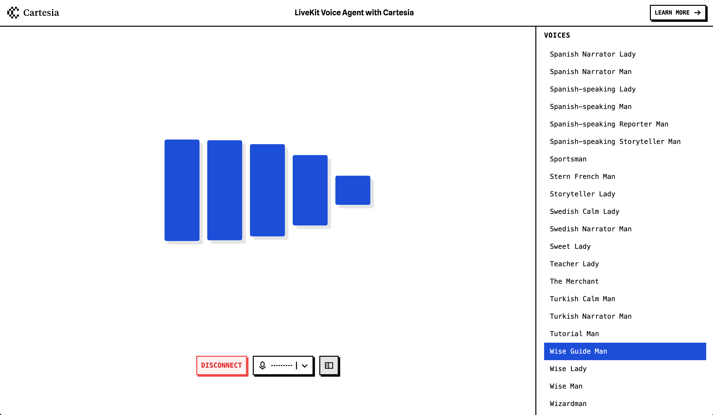

# Cartesia Voice Agent Example

This is a demo of a LiveKit [Voice Pipeline Agent](https://docs.livekit.io/agents/voice-agent/voice-pipeline/) using [Cartesia](https://www.cartesia.ai/) and GPT-4o-mini.

The example includes a custom Next.js frontend and Python agent.

## Live Demo

https://cartesia-assistant.vercel.app/



## Running the example

### Prerequisites

- Node.js
- Python 3.9-3.12
- LiveKit Cloud account (or OSS LiveKit server)
- Cartesia API key (for speech synthesis)
- OpenAI API key (for LLM)
- Deepgram API key (for speech-to-text)

### Frontend

Copy `.env.example` to `.env.local` and set the environment variables. Then run:

```bash
cd frontend
npm install
npm run dev
```

### Agent

Copy `.env.example` to `.env` and set the environment variables. Then run:

```bash
cd agent
python3 -m venv venv
source venv/bin/activate
pip install -r requirements.txt
python main.py dev
```
